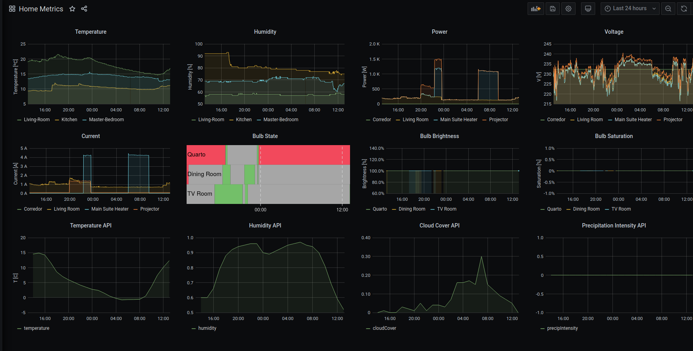

# Home Monitoring and Automation

Fully containerized home automation project, to bring visilibity and control to smart devices around the house. Hopefully will serve as starting point and inspiration to others.

## Dashboards
The home dashboard aggregates information from several sources, including:
- smart lamps
- smart plugs
- ipcam
- internet speed
- smart meter data
- weather data
- time

Metrics are pulled from several devices by prometheus including dumb ESP sensors that serve the metrics in HTML form and register their ip with consul manager.
These metrics can also be checked in a dedicated dashboard for a given window.

## Modules

Architecture has the following structure:

- grafana: dashboard
- prometheus: database and scraping metrics
- smartplug: endpoint for tp-link smartplugs. GET metrics and POST commands
- lifx: endpoint for lifx lamps. GET metrics and POST commands
- speedtest: Performs internet speed measurements
- prometheus-metrics: pulls metrics from endpoints
- consul: manage devices
- restreamer: to convert rtsp stream to html
- edp: connect to smart meter database

[Dev]
- Loki: Log management
- cAdvisor: Expose docker stat metrics
